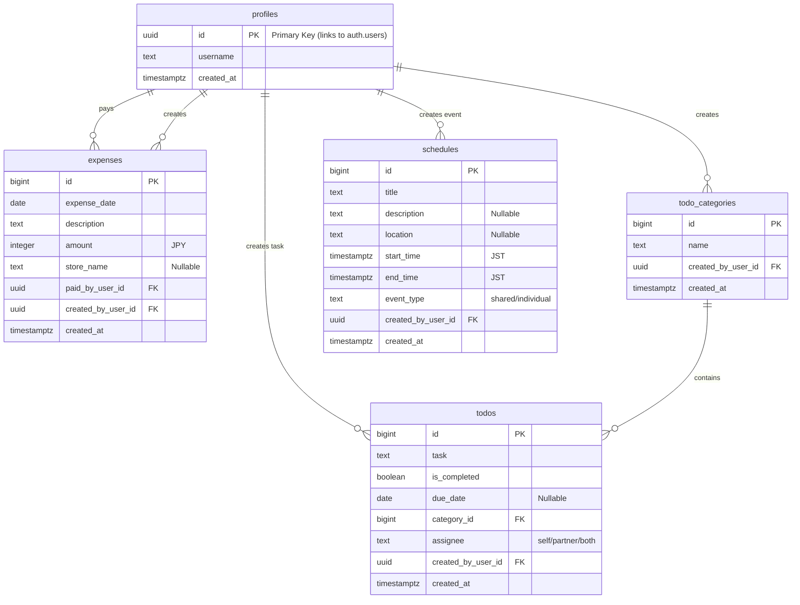

### **Database Schema**

This schema is designed for a PostgreSQL database, which is what Supabase uses.

#### **1. `profiles` Table**
Stores public user data, linked to Supabase's internal `auth.users` table.

| Column Name | Type | Constraints & Notes |
| :--- | :--- | :--- |
| `id` | `uuid` | **Primary Key**, Foreign Key to `auth.users.id`. |
| `username` | `text` | Not Null. The user's display name. |
| `created_at` | `timestamptz` | Not Null, `default now()`. |

#### **2. `expenses` Table**
Records all financial transactions in Japanese Yen.

| Column Name | Type | Constraints & Notes |
| :--- | :--- | :--- |
| `id` | `bigint` | **Primary Key**, auto-incrementing. |
| `expense_date` | `date` | Not Null. The date the expense occurred. |
| `description` | `text` | Not Null. What the expense was for. |
| `amount` | `integer` | Not Null. The cost in Japanese Yen (¥). |
| `store_name` | `text` | Nullable. The name of the store. |
| `paid_by_user_id` | `uuid` | Not Null, Foreign Key to `profiles.id`. |
| `created_by_user_id` | `uuid` | Not Null, Foreign Key to `profiles.id`. |
| `created_at` | `timestamptz` | Not Null, `default now()`. |

#### **3. `todo_categories` Table**
Defines categories for organizing To-Do items. Categories are shared between both users.

| Column Name | Type | Constraints & Notes |
| :--- | :--- | :--- |
| `id` | `bigint` | **Primary Key**, auto-incrementing. |
| `name` | `text` | Not Null, Unique. The name of the category. |
| `created_by_user_id` | `uuid` | Not Null, Foreign Key to `profiles.id`. |
| `created_at` | `timestamptz` | Not Null, `default now()`. |

#### **4. `todos` Table**
Stores individual To-Do tasks. Tasks can be assigned to Self, Partner, or Both users.

| Column Name | Type | Constraints & Notes |
| :--- | :--- | :--- |
| `id` | `bigint` | **Primary Key**, auto-incrementing. |
| `task` | `text` | Not Null. The content of the task. |
| `is_completed`| `boolean` | Not Null, `default false`. |
| `due_date` | `date` | Nullable. The deadline for the task. |
| `category_id` | `bigint` | Foreign Key to `todo_categories.id`. |
| `assignee` | `text` | Not Null. Values: 'self', 'partner', 'both'. |
| `created_by_user_id`| `uuid` | Not Null, Foreign Key to `profiles.id`. |
| `created_at` | `timestamptz` | Not Null, `default now()`. |

#### **5. `schedules` Table**
Stores shared and individual calendar events in JST timezone.

| Column Name | Type | Constraints & Notes |
| :--- | :--- | :--- |
| `id` | `bigint` | **Primary Key**, auto-incrementing. |
| `title` | `text` | Not Null. The title of the event. |
| `description`| `text` | Nullable. More details about the event. |
| `location` | `text` | Nullable. Location of the event. |
| `start_time`| `timestamptz` | Not Null. The start time of the event (JST). |
| `end_time` | `timestamptz` | Not Null. The end time of the event (JST). |
| `event_type` | `text` | Not Null. Values: 'shared', 'individual'. |
| `created_by_user_id`| `uuid` | Not Null, Foreign Key to `profiles.id`. |
| `created_at` | `timestamptz` | Not Null, `default now()`. |

### **ER Diagram (Mermaid Syntax)**

